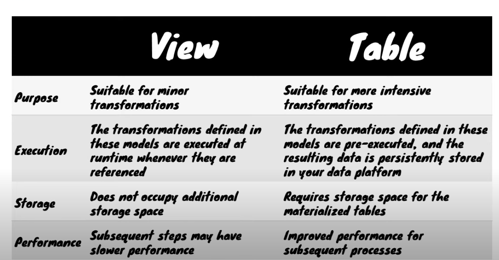
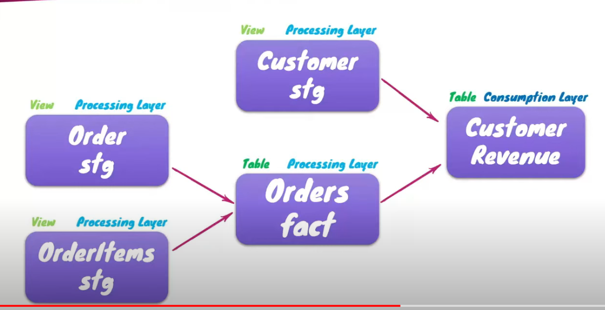
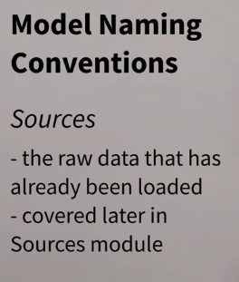
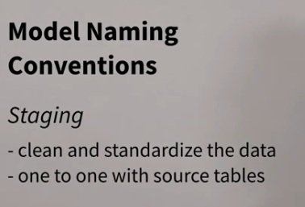
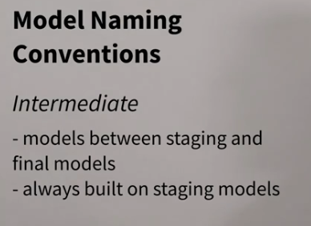
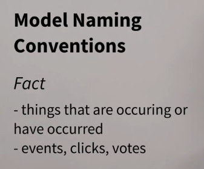
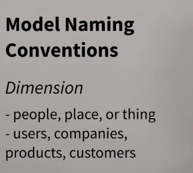

dbt default creation view can be changed:
    either -> dbt_project.yml
    or at file level -> {{ config(materialized:'table') }}

## Source
Should be loaded using fivertan or stitch or some manual
orchestration

## Staging Model
Light Touch 

## Intermediate model
Should only reference stagin model | Fact model

## Fact Model Long Table

## Dimension Model
